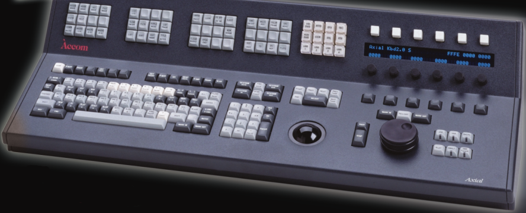

# Accom Axial Control Panel

_Turning an obsolete video editor console into a mothership-sized keyboard + trackball + stream deck_

  
_Control panel (from original brochure)_

## Purpose

### What does this project do?

When complete, this project will provide the software necessary to make an obsolete video editing console useful in the context of a modern pc.

I want to make the control panel work as a USB HID input device. However, this thing has _a lot_ of blinkenlights, and it would be a shame to not use them! The display and those dials just beg to be used for to select audio in/out devices and adjust volume levels; per-app tool setting adjustments; media center integration; home automation; etc. -- and of course a [KSP control panel](https://hackaday.io/project/8891-ksp-gegi) mode!

Most of the "common keyboard keys" get to play the role of a regular USB keyboard, but all those extra keys? It's possible I can make use of the VFD and surrounding controls to offer on-device management of macros and configuration, but I imagine I'll create a host-side companion (desktop/cli app and daemon/driver) which is what most advanced peripherals require (such as macro keyboards, or even most Logitech keyboards or mice these days). The host program would also be needed to provide whatever data might be useful to indicate on the VFD and lighted keys.

### Y U No Stream Deck?

I came across the term "Stream Deck", which is apparently the product name of a glorified macro keyboard that [costs](https://www.elgato.com/en/stream-deck) just over half as much as my entire console did. As with everything, it has its [pro's](https://www.pocket-lint.com/gadgets/news/151906-elagato-stream-deck-best-features) and [con's](https://www.pcgamer.com/no-you-dont-need-a-stream-deck/), and "of course" it has no Linux software. But hey, here's the keyword should you be searching for it.

Of course, there are free alternatives, such as [deej](https://github.com/omriharel/deej) although that one in particular is much simpler than I'd need.

### Why is this project useful?

I never claimed it would be useful! ;-p At the very least, it is _almost entirely useless_ if you don't have the intended hardware for it (see below) or can find some other use for the code in this project.

### How do I get started?

If you don't have a console, I'd advise you to hit the 2nd-hand websites, and wish you luck with that. If do you have one -- or if you have another idea in mind -- all you'll need is a computer for editing the code, and a microcontroller for running it. The code is intended for a Teensy 3.5, but with some tweaking any Arduino-compatible platform should work reasonably well.

### Where can I get more help, if I need it?

This project is thoroughly documented on its [Hackaday Project page](https://hackaday.io/project/187258-repurposing-an-accom-axial-control-panel).

## Origin

### History

Back in the 1990s, the Accom Axial was an awesome video editing system, but things turned digital and non-linear, and Accom became obsolete and closed up shop. The editing system was originally comprised of a control panel and two rack-mounted chassis, and required many peripherals in the form of displays, tape machines, audio mixers, signal scopes, et cetera ad nauseam.

The control panel; the actual brains of the thing, including the interfaces to the rest of the production equipment, reside in two separate rack-mounted chassis (yup, that's plural), which I don't have. Not that I even want them; those cost several times as much as the control panel itself, which is already plenty expensive -- and besides, I don't plan to use it for film production anyway, although back in the day I used to work with ones just like this.

The manufacturer, Accom, [folded](https://www.tvtechnology.com/news/accom-dims-the-lights-tech-support-to-continue) in late 2005. Their web site is now defunct, and their documentation is not that easy to come by since the [archive](http://web.archive.org/web/*/ftp://ftp.accom.com/*) does not include their FTP site. I have since found that [support continued](https://web.archive.org/web/20060210114811/http://editsuite.com/new/viewtopic.php?id=67) under the Abekas name, which itself was eventually [acquired](https://www.rossvideo.com/ross-acquires-abekas-adding-core-video-server-technology-replay/) by Canada-based Ross Video. I have reached out to current and former staff at these companies, contacts listed as international distributors, and repair centres around the world -- in the hope that someone, somewhere, has kept any of the old paperwork and is willing to share. So far, no luck. This means I'll have to reverse engineer it.

### Hardware

The control panel itself is fairly hefty: The thing weighs around 7.7kg, is 78cm wide, 16cm tall, and 32cm deep.

In total, there are 189 buttons, 23 of which are individually lightable, arranged into a full qwerty layout, a combined numeric/navigation block, five clusters of 12 keys each, other minor clusters, and a 2x40 character VFD display with a blue-on-black colour scheme surrounded by six sets of lighted switches, dial knobs, and keys. There's also a large trackball (although with no mouse buttons nearby), and a solid-metal jog wheel.

## Misc. notes

* [Custom "waterslide" decals for keycaps](https://old.reddit.com/r/MechanicalKeyboards/comments/nncx59/how_to_diy_custom_print_keycaps_using_waterslide/)